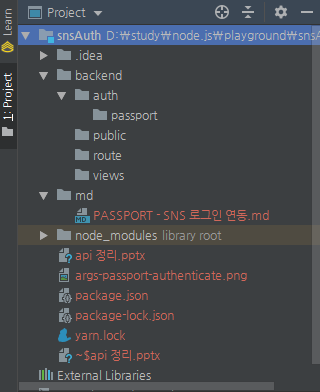

# 프로젝트 세팅 (express-generator 없이)

  ㅁㄴㅇㄹ

## 디렉터리 및 패키지 의존성 정의 파일 생성

터미널에 npm init 명령어를 입력해 package.json 파일을 생성한다.

```bash
$ npm init
...
콘솔창에서 물어보는 것들에 대해 타이핑으로 대답한다.
package name: (snsauth) snsAuth
Sorry, name can no longer contain capital letters.
package name: (snsauth) snsauth
version: (1.0.0) 1.0.0
description: enjoy yourself.
entry point: (index.js) index.js
test command:
git repository:
keywords:
author: sgjung
license: (ISC) MIT
About to write to D:\study\node.js\playground\snsAuth\package.json:

{
  "name": "snsauth",
  "version": "1.0.0",
  "description": "enjoy yourself.",
  "main": "index.js",
  "scripts": {
    "test": "echo \"Error: no test specified\" && exit 1"
  },
  "author": "sgjung",
  "license": "MIT"
}

```


## 의존성 설치

### sequelize-cli, mysql2, sequelize 설치

여기서는 mysql, sequelize를 이용해 Database 연산을 할것이다. 따라서 mysql, sequelize를 설치해준다.  

```bash
# node_modules, package-lock.json 파일이 생성된다.
$ npm i -g sequelize-cli
$ yarn add sequelize mysql2

# config, migrations, models, seeders 폴더가 생성된다.
$ sequelize init
```

  

### express, express-session 설치

```bash
$ yarn add express express-session
```

### cookie-parser, morgan, connect-flash 설치

```bash
$ yarn add cookie-parser morgan connect-flash
```

### ejs 설치

```bash
$ yarn add ejs
```

### nodemon 설치

서버코드에 수정사항이 생길 때마다 매번 서버를 재시작하는 것이 귀찮으므로 nodemon모듈로 서버를 자동 재시작한다. 앞으로 서버코드를 수정하면 nodemon이 서버를 자동으로 재시작해준다.  

  

package.json의 script에 nodemon app 을 입력해준다. (배포시에는 nodemon app 대신 node app 으로 입력해야 한다.)  

```json
{
  "name": "snsauth",
  "version": "1.0.0",
  "description": "enjoy yourself.",
  "main": "index.js",
  "scripts": {
    "start": "nodemon app",
    "test": "echo \"Error: no test specified\" && exit 1"
  },
  "author": "sgjung",
  "license": "MIT",
  "dependencies": {
    "connect-flash": "^0.1.1",
    "cookie-parser": "^1.4.4",
    "ejs": "^2.6.2",
    "express": "^4.17.1",
    "express-session": "^1.16.2",
    "morgan": "^1.9.1",
    "mysql2": "^1.6.5",
    "sequelize": "^5.10.1"
  },
  "devDependencies": {
    "nodemon": "^1.19.1"
  }
}

```


nodemon이 실행되는 콘솔에 rs를 입력해 수동으로 재시작할 수도 있다.

```bash
$ npm i -g nodemon
$ npm i -D nodemon
```

  

## dotenv 설치

전역으로 비밀 키 등을 담고 있는 properties 같은 역할의 파일을 생성한다. 비밀 키등을 소스상에 텍스트로 하드코딩하지 않고 이곳에 비밀키등을 놓아두고 키의 이름으로 값을 가져올 예정이다.  

조금 뒤에 생성할 app.js에서 dotenv는 cookieParser와 express-session을 사용해 입력하게 될 snsAuthSecret과 같은 비밀키를 .env파일에 생성하게 되는데, 이 .env파일을 읽어 process.env객체에 넣는다.  

```bash
$ yarn add dotenv
```


## app.js 작성 및 디렉터리 생성

### 디렉터리(views, route, public, auth) 생성

입맛에 맞게 아래와 같이 디렉터리를 구성했다.



### app.js

```javascript
var createError = require('http-errors');
const express = require('express');
const cookieParser = require('cookie-parser');
const morgan = require('morgan');
const path = require('path');
const session = require('express-session');
const flash = require('connect-flash');
// TODO :: 디렉터리 위치 찾을 것.
// require('dotenv').config();

const demoRouter = require('./route/demo/demoPage');

const app = express();

app.set('views', path.join(__dirname, 'views'));
app.set('view engine', 'ejs');
app.set('port', process.env.PORT || 9999);

app.use(morgan('dev'));
app.use(express.static(path.join(__dirname, 'public')));
app.use(express.json());

// TODO
app.use(express.urlencoded({extended: false}));

// TODO :: 디렉터리 위치 찾을 것.
// app.use(cookieParser(process.env.COOKIE_SECRET));

app.use(session({
    resave: false,
    saveUninitialized: false,
    secret: 'snsAuthSecret',
    cookie: {
        httpOnly: true,
        secure: false
    },
}));

app.use(flash());

app.use('/', demoRouter);

// app.use(
//     (req, res, next) => {
//         const err = new Error('Not Found');
//         err.status = '404';
//         next(err);
//     }
// );

app.use(function(req, res, next) {
    next(createError(404));
});

// app.use(
//     (err, req, res, next) => {
//         res.locals.message = err.message;
//         res.locals.error = req.app.get('env') === 'development' ? err : {};
//         res.status(err.status || 500);
//         res.render('error');
//     }
// );

app.use(function(err, req, res, next) {
    // set locals, only providing error in development
    res.locals.message = err.message;
    res.locals.error = req.app.get('env') === 'development' ? err : {};

    // render the error page
    res.status(err.status || 500);
    res.render('error');
});

app.listen(app.get('port'), () => {
   console.log(app.get('port'), '번 포트에서 대기중')
});
```


 