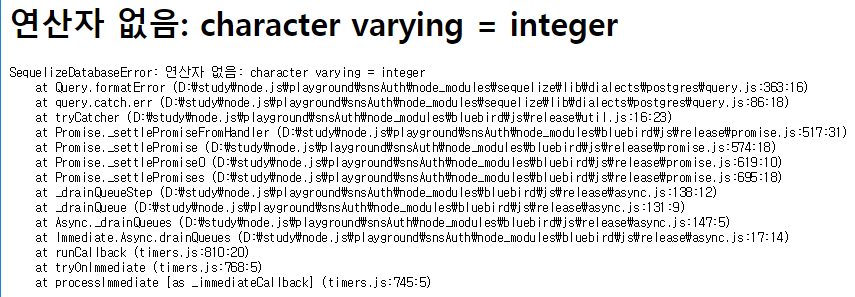

# 프로젝트 세팅 (express-generator 없이)

  ㅁㄴㅇㄹ

## 디렉터리 및 패키지 의존성 정의 파일 생성

터미널에 npm init 명령어를 입력해 package.json 파일을 생성한다.

```bash
$ npm init
...
콘솔창에서 물어보는 것들에 대해 타이핑으로 대답한다.
package name: (snsauth) snsAuth
Sorry, name can no longer contain capital letters.
package name: (snsauth) snsauth
version: (1.0.0) 1.0.0
description: enjoy yourself.
entry point: (index.js) index.js
test command:
git repository:
keywords:
author: sgjung
license: (ISC) MIT
About to write to D:\study\node.js\playground\snsAuth\package.json:

{
  "name": "snsauth",
  "version": "1.0.0",
  "description": "enjoy yourself.",
  "main": "index.js",
  "scripts": {
    "test": "echo \"Error: no test specified\" && exit 1"
  },
  "author": "sgjung",
  "license": "MIT"
}

```


## 의존성 설치

### sequelize-cli, postres, sequelize 설치

여기서는 mysql, sequelize를 이용해 Database 연산을 할것이다. 따라서 postgres, sequelize를 설치해준다.  

```bash
# node_modules, package-lock.json 파일이 생성된다.
$ npm i -g sequelize-cli
$ yarn add sequelize pg pg-hstore

# config, migrations, models, seeders 폴더가 생성된다.
$ sequelize init
```

  

### express, express-session 설치

```bash
$ yarn add express express-session
```

  

### middleware 설치

```bash
$ yarn add middleware
```


### cookie-parser, morgan, connect-flash 설치

```bash
$ yarn add cookie-parser morgan connect-flash
```

### ejs 설치

```bash
$ yarn add ejs
```

### nodemon 설치

서버코드에 수정사항이 생길 때마다 매번 서버를 재시작하는 것이 귀찮으므로 nodemon모듈로 서버를 자동 재시작한다. 앞으로 서버코드를 수정하면 nodemon이 서버를 자동으로 재시작해준다.  

  

package.json의 script에 nodemon app 을 입력해준다. (배포시에는 nodemon app 대신 node app 으로 입력해야 한다.)  

```json
{
  "name": "snsauth",
  "version": "1.0.0",
  "description": "enjoy yourself.",
  "main": "app.js",
  "scripts": {
    "start": "nodemon ./backend/app",
    "test": "echo \"Error: no test specified\" && exit 1"
  },
  "author": "sgjung",
  "license": "MIT",
  "dependencies": {
    "connect-flash": "^0.1.1",
    "cookie-parser": "^1.4.4",
    "dotenv": "^8.0.0",
    "ejs": "^2.6.2",
    "express": "^4.17.1",
    "express-session": "^1.16.2",
    "morgan": "^1.9.1",
    "mysql2": "^1.6.5",
    "sequelize": "^5.10.1"
  },
  "devDependencies": {
    "nodemon": "^1.19.1"
  }
}
```


nodemon이 실행되는 콘솔에 rs를 입력해 수동으로 재시작할 수도 있다.

```bash
$ npm i -g nodemon
$ npm i -D nodemon
```

  

## dotenv 설치

전역으로 비밀 키 등을 담고 있는 properties 같은 역할의 파일을 생성한다. 비밀 키등을 소스상에 텍스트로 하드코딩하지 않고 이곳에 비밀키등을 놓아두고 키의 이름으로 값을 가져올 예정이다.  

조금 뒤에 생성할 app.js에서 dotenv는 cookieParser와 express-session을 사용해 입력하게 될 snsAuthSecret과 같은 비밀키를 .env파일에 생성하게 되는데, 이 .env파일을 읽어 process.env객체에 넣는다.  

```bash
$ yarn add dotenv
```


## app.js 작성 및 디렉터리 생성

### 디렉터리(views, route, public, auth) 생성

입맛에 맞게 아래와 같이 디렉터리를 구성했다.


### app.js

```javascript
var createError = require('http-errors');
const express = require('express');
const cookieParser = require('cookie-parser');
const morgan = require('morgan');
const path = require('path');
const session = require('express-session');
const flash = require('connect-flash');
// TODO :: 디렉터리 위치 찾을 것.
// require('dotenv').config();

const demoRouter = require('./route/demo/demoPage');

const app = express();

app.set('views', path.join(__dirname, 'views'));
app.set('view engine', 'ejs');
app.set('port', process.env.PORT || 9999);

app.use(morgan('dev'));
app.use(express.static(path.join(__dirname, 'public')));
app.use(express.json());

// TODO
app.use(express.urlencoded({extended: false}));

// TODO :: 디렉터리 위치 찾을 것.
// app.use(cookieParser(process.env.COOKIE_SECRET));

app.use(session({
    resave: false,
    saveUninitialized: false,
    secret: 'snsAuthSecret',
    cookie: {
        httpOnly: true,
        secure: false
    },
}));

app.use(flash());

app.use('/', demoRouter);

app.use(function(req, res, next) {
    next(createError(404));
});

app.use(function(err, req, res, next) {
    // set locals, only providing error in development
    res.locals.message = err.message;
    res.locals.error = req.app.get('env') === 'development' ? err : {};

    // render the error page
    res.status(err.status || 500);
    res.render('error');
});

app.listen(app.get('port'), () => {
   console.log(app.get('port'), '번 포트에서 대기중')
});
```


### package.json

package.json의 scripts 객체 내의 start 항목에 대한 값으로 "nodemon ./backend/app" 을 입력해준다. 보통은 nodemon app 과 같이 기본 설정으로 제공되는 경우가 많다. 하지만 위에서 한 설정은 node.js 앱을 별도의 디렉터리에 위치시키기 때문에 위치시켰던 별도의 디렉터리내의 app.js를 기록해준다.

  

app.js말고 다른 이름을 사용해도 된다. 다만 start 항목에 제대로 기입해놓아야 한다.


```javascript
{
  "name": "snsauth",
  "version": "1.0.0",
  "description": "enjoy yourself.",
  "main": "app.js",
  "scripts": {
    "start": "nodemon ./backend/app",
    "test": "echo \"Error: no test specified\" && exit 1"
  },
  "author": "sgjung",
  "license": "MIT",
  "dependencies": {
    "connect-flash": "^0.1.1",
    "cookie-parser": "^1.4.4",
    "dotenv": "^8.0.0",
    "ejs": "^2.6.2",
    "express": "^4.17.1",
    "express-session": "^1.16.2",
    "morgan": "^1.9.1",
    "mysql2": "^1.6.5",
    "sequelize": "^5.10.1"
  },
  "devDependencies": {
    "nodemon": "^1.19.1"
  }
}
```


## DB 연동

Postgresql을 ORM으로 연동하는 절차를 정리한다. postgresql을 설치하는 과정에 대한 정리는 생략. 

### sequelize init

sequelize init 명령어를 입력해 sequelize를 사용하기 위한 준비를 한다.  

```bash
$ sequelize init
```


sequelize init을 수행하고 나면

- config
- migrations
- models
- seeders

디렉터리가 생성된다.

  

### sequelize 부가 설정

sequelize 설치 후에 모델 소스들을 작성하고나서 바로 sequelize db:create 명령어를 사용하면 에러를 낸다.  
(mysql도 동일한 증상, 별도의 설정을 해주어야 한다. 여기서는 postgresql에 대해서만 정리)  

이런 문제를 해결하기 위해서는 별도의 의존성들을 추가해 주어야 한다.

- pg
- pg-hstore
- sequelize-pg-utilities


>  참고자료 : https://medium.com/@purposenigeria/using-postgresql-and-sequelize-to-persist-our-data-c86854a3c6ac

```bash
$ yarn add pg pg-hstore
$ yarn add sequelize-pg-utilities
$ sequelize db:create
```

  


### model

참고자료로 선택한 책인 'Node.js 교과서'내의 예제소스에는 오타가 있다.

```javascript
module.exports = (sequelize, DataTypes) => {
    sequelize.define(
        'user',
        {
            email: {
                type: DataTypes.STRING(40),
                allowNull: true,
                unique: true
            }
        },
        ...
    );
};
```

와 같이 되어 있는 것을 아래와 같이 return문을 추가하여 주어야 한다.  
즉,

- sequelize.define('user', {....})  
  을
- return sequelize.define('user', {...})  
  

로 고쳐주어야 한다.  


```javascript
module.exports = (sequelize, DataType) => {
    return sequelize.define(
        'user',
        {
            email: {
                type: DataTypes.STRING(40),
                allowNull: true,
                unique: true
            }
        }
    );
};
```


#### user.js

사용자 테이블이다.  
**../models/user.js**

```javascript
module.exports = (sequelize, DataTypes) => {
    return sequelize.define(
        'user',
        {
            email: {
                type: DataTypes.STRING(40),
                allowNull: true,
                unique: true,
            },
            nick:{
                type: DataTypes.STRING(15),
                allowNull: false,
            },
            password:{
                type: DataTypes.STRING(100),
                allowNull: true,
            },
            provider: {
                type: DataTypes.STRING(10),
                allowNull: false,
                defaultValue: 'local',
            },
            snsId: {
                type: DataTypes.STRING(30),
                allowNull: true,
            },
        },
        {
            timestamps: true,
            paranoid: true
        }
    );
};
```

#### post.js

**../models/post.js**  
글작성/수정/조회를 위한 Post 테이블이다.

```javascript
module.exports = function(sequelize, DataTypes){
    return sequelize.define(
        'post',
        {
            content:{
                type: DataTypes.STRING(300),
                allowNull: false,
            },
            img:{
                type: DataTypes.STRING(200),
                allowNull: true,
            },
        },
        {
            timestamps: true,
            paranoid: true,
        }
    )
};
```

#### hashtag.js

**../models/hashtag.js**  
해시태그 연동을 위한 테이블이다.

```javascript
module.exports = function(sequelize, DataTypes){
    return sequelize.define(
        'hashtag',
        {
            title:{
                type: DataTypes.STRING(30),
                allowNull: false,
                unique: true
            }
        },
        {
            timestamps: true,
            paranoid: true
        }
    );
};
```

#### index.js

**../models/index.js**  

```javascript
'use strict';

const Sequelize = require('sequelize');
const env = process.env.NODE_ENV || 'development';
const config = require('../config/config')[env];
const db = {};

const sequelize = new Sequelize(
    config.database, config.username, config.password,  config,
);

db.sequelize = sequelize;
db.Sequelize = Sequelize;
db.User = require('./user')(sequelize, Sequelize);
db.Post = require('./post')(sequelize, Sequelize);
db.Hashtag = require('./hashtag')(sequelize, Sequelize);

db.User.hasMany(db.Post);
db.Post.belongsTo(db.User);

db.Post.belongsToMany(db.Hashtag, {through: 'PostHashtag'});
db.Hashtag.belongsToMany(db.Post, {through: 'PostHashtag'});

db.User.belongsToMany(
    db.User,
    {
        foreignKey: 'followingId',
        as: 'Followers',
        through: 'Follow',
    }
);

db.User.belongsToMany(
    db.User,
    {
        foreignKey: 'followerId',
        as: 'Followings',
        through: 'Follow',
    }
);

module.exports = db;
```

  

### app.js

models/index.js에 정의한 model 구성코드를 app.js에서 호출을 해야 동작한다.  

app.js에 추가하는 model관련 코드는 단 두줄이다.  

```javascript
...
const {sequelize} = require('../models');
...
sequelize.sync();
```


- models 디렉터리에 정의한 index.js를 기반으로 sequelize객체를 얻어낸 후 
- 이 sequelize 객체로 sync() 연산을 수행한다.

이 sync() 함수를 호출하고 나면 user.js, post.js, hashtag.js에 정의한 모델과 index.js에 정의한 매핑테이블 관계의 테이블들이 DB에 직접 만들어지게 된다.  


```javascript
var createError = require('http-errors');
const express = require('express');
const cookieParser = require('cookie-parser');
const morgan = require('morgan');
const path = require('path');
const session = require('express-session');
const flash = require('connect-flash');

const demoRouter = require('./route/demo/demoPage');

/**
 * models 의 index.js 임포트
 *  - index.js에서는 /models에 정의한 각 모델들을 볼러들이고,
 *  - { User: sequelize1 , Post: sequelize2... } 와 같은 형식으로 객체를 만들어낸다.
 */
const {sequelize} = require('../models');

const app = express();
sequelize.sync();

app.set('views', path.join(__dirname, 'views'));
app.set('view engine', 'ejs');
app.set('port', process.env.PORT || 9999);

app.use(morgan('dev'));
app.use(express.static(path.join(__dirname, 'public')));
app.use(express.json());

app.use(express.urlencoded({extended: false}));
// app.use(cookieParser(process.env.COOKIE_SECRET));

app.use(session({
    resave: false,
    saveUninitialized: false,
    secret: 'snsAuthSecret',
    cookie: {
        httpOnly: true,
        secure: false
    },
}));

app.use(flash());
app.use('/', demoRouter);

app.use(function(req, res, next) {
    next(createError(404));
});

app.use(function(err, req, res, next) {
    // set locals, only providing error in development
    res.locals.message = err.message;
    res.locals.error = req.app.get('env') === 'development' ? err : {};

    // render the error page
    res.status(err.status || 500);
    res.render('error');
});

app.listen(app.get('port'), () => {
   console.log(app.get('port'), '번 포트에서 대기중')
});
```

  

### 결과 확인

제대로 설정되었는지 확인해보기 위해 app.js에 sequelize코드를 작성한 후  

npm start를 한다.

```bash
$ npm start
Executing (default): CREATE TABLE IF NOT EXISTS "users" ("id"   SERIAL , "email" VARCHAR(40) UNIQUE, "nick" VARC
HAR(15) NOT NULL, "password" VARCHAR(100), "provider" VARCHAR(10) NOT NULL DEFAULT 'local', "snsId" VARCHAR(30),
 "createdAt" TIMESTAMP WITH TIME ZONE NOT NULL, "updatedAt" TIMESTAMP WITH TIME ZONE NOT NULL, "deletedAt" TIMES
TAMP WITH TIME ZONE, PRIMARY KEY ("id"));
Executing (default): SELECT i.relname AS name, ix.indisprimary AS primary, i
```


## 카카오 API 연동

passport를 이용해 카카오 API로 로그인하는 과정을 정리한다.

### 의존성 설치

- passport
- passport-local 
- passport-kakao 
- passport-oauth2
- bcrypt

 를 설치한다.  

```bash
$ yarn add passport passport-local passport-kakao passport-oauth2
$ yarn add bcrypt
```

### 트러블 슈팅

#### TypeError : User.find is not a function

Sequelize 5를 사용하는 것으로 인해 나타나는 문제이다. Sequelize4에서는 findOne이나 findAll을 사용하도록 자동 변환되고 있다. 하지만 Sequelize5 에서는 find 자체가 deprecated된것으로 보인다.

> 참고자료 : https://www.zerocho.com/category/etc/post/5b4c1d526a3abe001b94de0b

  

따라서 Sequelize버전을 4로 낮추거나 5로 올린후 findAll 또는 findOne을 사용하면 된다.

여기서는 4.x로 바꿔서 진행했다. ( 버전 : ^4.37.6)


#### InternalOAuthError is not defined

> ReferenceError: InternalOAuthError is not defined

라는 문구를 접하게 되는데 이 경우   

passport-oauth2를 설치하는 것으로 해결 가능하다.  

참고자료 : https://devtalk.kakao.com/t/passport-kakao-internaloautherror/58338


#### character varing = integer



이 경우 아래와 같이 User.find 내의 profile.id에 대한where 조건에 대한 값을 문자열로 형변환해준다. 처음 테이블을 만들때 STRING타입으로 했는데, 카카오에서는 숫자값으로 전달받기 때문에 나타난 문제이다. 

```javascript
const KakaoStrategy = require('passport-kakao').Strategy;
const {User} = require('../../../models');

module.exports = (passport) => {
    passport.use(
        new KakaoStrategy(
            {
                clientID: process.env.KAKAO_ID,
                callbackURL: '/auth/kakao/callback'
            },
            async (accessToken, refreshToken, profile, done)=>{
                try{
                    console.log('kakaoStrategy >>> ', User );

                    const exUser = await User.find(
                        {where: {snsId: profile.id+''}}
                    //    문자열로 넘겨야 한다. user 테이블의 snsId 항목을 STRING으로 했기 때문.
                    //    (카카오에서 넘겨주는 profile.id의 타입은 숫자 타입이다.)
                    //    http://database.sarang.net/?inc=read&aid=7859&criteria=pgsql&subcrit=&id=&limit=20&keyword=unix&page=1
                    );
                    // const exUser = await User.findAll({where: {snsId: profile.id, provider: 'kakao'} });

                    if(exUser){
                        done(null, exUser);
                    }
                    else{
                        const newUser = await User.create(
                            {
                                email: profile._json && profile._json.kaccount_email,
                                nick: profile.displayName,
                                snsId: profile.id,
                                provider: 'kakao'
                            }
                        );

                        done(null, newUser);
                    }
                }
                catch(error){
                    console.error(error);
                    done(error);
                }
            }
        )
    );
};
```


